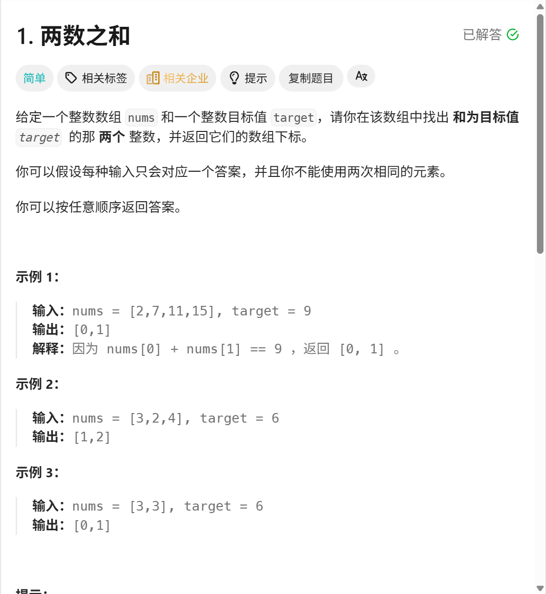

# LeetCode Copy Helper

一个将 LeetCode 题目复制为 Markdown 格式的用户脚本。

## 功能

- 将 LeetCode 题目内容复制为格式化的 Markdown
- 支持中文和英文题目页面
- 正确处理代码块、列表、表格等格式
- 支持上标（如 10^4）和下标
- 智能过滤和提取题目标签
- 按钮集成到题目页面工具栏中

## 安装

1. 安装浏览器扩展：
   - Chrome/Edge: [Tampermonkey](https://www.tampermonkey.net/)
   - Firefox: [Greasemonkey](https://addons.mozilla.org/en-US/firefox/addon/greasemonkey/)

2. 点击以下链接安装脚本：
   [leetcode-copy.user.js](https://raw.githubusercontent.com/galaxywk223/leetcode-copy-script/main/leetcode-copy.user.js)

## 使用方法

1. 打开任意 LeetCode 题目页面
2. 在题目页面的工具栏中找到「复制题目」按钮
3. 点击按钮后，题目内容会自动复制到剪贴板
4. 粘贴到任何支持 Markdown 的编辑器中

## 截图

## 许可证

MIT License